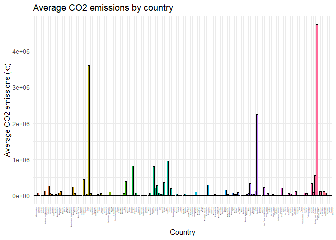
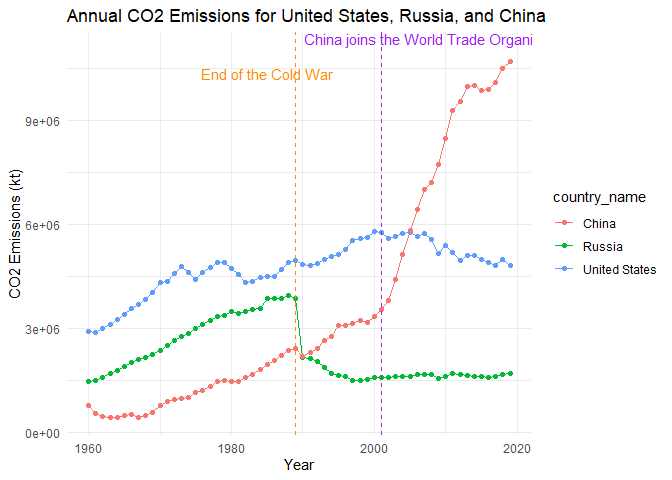
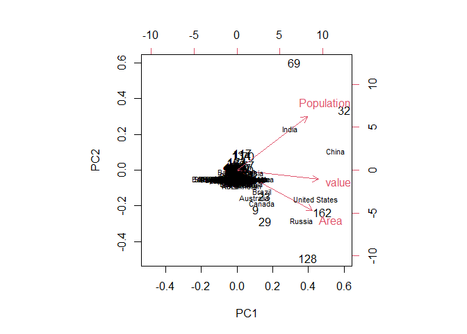
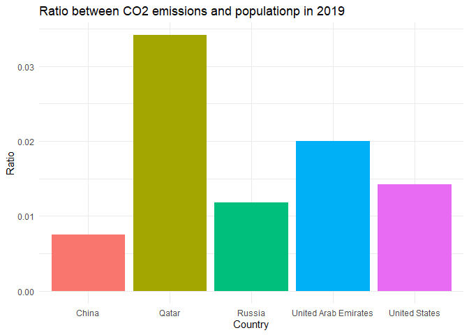
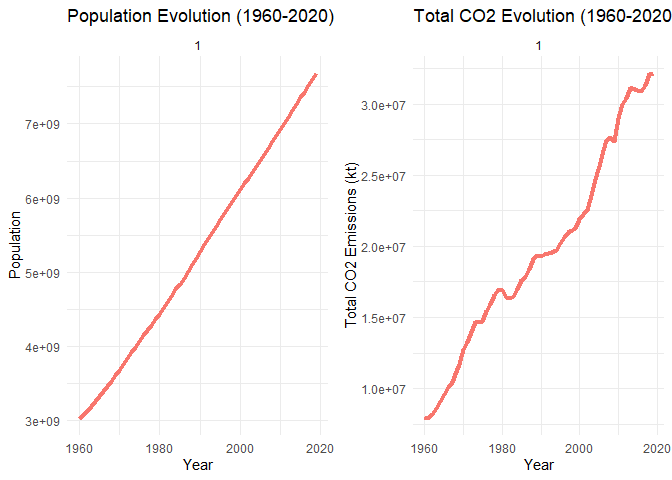

# 1 Introduction

In this project, we will conduct an analysis of global carbon dioxide
(CO2) emissions from 1960 to 2019. The main objective is to examine
these data, graph them and then predict future trends in CO2 emissions.
The aim is to determine whether, in the current situation, the
commitments made under the Paris agreements and the targets set for 2030
and 2050 will be reached.

To accomplish this task, we made use of three databases, one containing
carbon dioxide emissions by country from 1960 to 2019, another of these
databases also included the population of each country in 2019, as well
as their respective surface areas. And the last one is containing the
total population for each year from 1960 to 2019. We subsequently merged
these databases into a single entity, making it easier to exploit the
data and produce the necessary estimates.

You can find the databases by clicking here ([first
database](https://www.kaggle.com/datasets/moazzimalibhatti/co2-emission-by-countries-year-wise-17502022?rvi=1),
[second
database](https://www.kaggle.com/datasets/ulrikthygepedersen/co2-emissions-by-country),
[third](https://www.kaggle.com/datasets/jarredpriester/global-population))

# 2 Data cleaning

As a first step, we’re going to clean up the database by removing rows
containing missing values and ensuring that there are only rows
containing country names.

    # Reading data from CSV files
    Data_WorldCO2 <- read_csv("co2_emissions_kt_by_country.csv")

    Data_CO2 <- read_csv2("CO2_emission2.csv")
    Data_CO2 <- Data_CO2 %>% filter(Year >= 1960)

    glob_pop <- read.csv("Global_annual_population.csv")

    # List of words to remove to keep only countries, not regions or others
    words_to_remove <- c('Asia', 'Euro', 'Caribbean', 'Africa', 'South Africa', 'demo', 
                         'IDA', 'IBRD', 'income', 'World', 'Europe', 'North America', 
                         'South Asia', 'OECD members', 'Euro area', 'Arab World',
                         'Heavily indebted poor countries (HIPC)', 'Small states', 
                         'Other small states', 'Fragile and conflict-affected situations', 
                         'Least developed countries: UN classification',
                         'Pacific island small states', "HIPC", "poor countries")

    # Filter data to exclude rows containing specific words
    Data_WorldCO2 <- Data_WorldCO2[!grepl(paste(words_to_remove, collapse = '|'),
                                          Data_WorldCO2$country_name), ]

    # Modify country names to match the two datasets
    Data_WorldCO2 <- Data_WorldCO2 %>%
      mutate(country_name = case_when(
        country_name == "Gambia, The" ~ "Gambia",
        country_name == "Hong Kong SAR, China" ~ "Hong Kong",
        TRUE ~ country_name
      ))

    # Replace "Iran, Islamic Rep." with "Iran" in the "country_name" column
    Data_WorldCO2 <- Data_WorldCO2 %>%
      mutate(country_name = ifelse(country_name == "Iran, Islamic Rep.", "Iran", 
                                   country_name))

    # Replace "Venezuela, RB" with "Venezuela" in the "country_name" column
    Data_WorldCO2 <- Data_WorldCO2 %>%
      mutate(country_name = ifelse(country_name == "Venezuela, RB", "Venezuela", 
                                   country_name))

    # Replace "Egypt, Arab Rep." with "Egypt" in the "country_name" column
    Data_WorldCO2 <- Data_WorldCO2 %>%
      mutate(country_name = ifelse(country_name == "Egypt, Arab Rep.", "Egypt", 
                                   country_name))

    # Replace "Yemen, Rep." with "Yemen" in the "country_name" column
    Data_WorldCO2 <- Data_WorldCO2 %>%
      mutate(country_name = ifelse(country_name == "Yemen, Rep.", "Yemen", 
                                   country_name))

    Data_WorldCO2 <- select(Data_WorldCO2, -country_code)
    Data_WorldCO2 <- Data_WorldCO2 %>%
      mutate(country_name = ifelse(country_name == "Russian Federation", "Russia", 
                                   country_name))

    Data_CO2 <- select(Data_CO2, -Code)

    # Rename columns of the Data_CO2 table to match those of Data_WorldCO2
    Data_CO2 <- Data_CO2 %>%
      rename(country_name = Country, value = CO2, year = Year)

    # Merge the two tables using the "country_name" and "year" columns
    result <- left_join(Data_WorldCO2, Data_CO2, by = c("country_name", "year"))
    result <- select(result, -value.y)
    result <- result %>%
      rename(value = value.x)

    # Filter countries with at least one missing value in a column other than "country_name"
    countries_with_missing_values <- result %>%
      filter(rowSums(across(everything(), is.na)) > 0) %>%
      select(country_name)

    result_cleaned <- anti_join(result, countries_with_missing_values, by = "country_name")

    # Delete column "X" and rename column "Year".
    glob_pop <- glob_pop %>%
      select(-X) %>%
      rename(year = Year) %>%
      mutate(Population = Population * 1e9) 

# 3 Visualization

## 3.1 Average Emissions of all countries

    average_emissions <- aggregate(. ~ country_name, data = result_cleaned, mean)

    # Create the plot with a condition for the fill color
    ggplot(average_emissions, aes(x = country_name, y = value, fill = country_name)) +
      geom_bar(stat = "identity", color = "black") +
      labs(title = "Average CO2 emissions by country",
           x = "Country", y = "Average CO2 emissions (kt)") +
      theme_minimal() +
      theme(axis.text.x = element_text(angle = 90, hjust = 1, size = 2.5)) +
      guides(fill = "none")

Based on this graph representing the average emissions of each country
in the world from 1960 to 2019, we can see that three countries stand
out in terms of CO2 emissions: China, Russia, and the United States.
Let’s take a closer look at the CO2 emissions of the three biggest
polluters.

## 3.2 Top 3 CO2 Emitting Countries

    top_3_polluters <- c('United States', 'Russia', 'China')
    # Subset data for the top 3 polluters
    df_subset <- result_cleaned[result_cleaned$country_name %in% top_3_polluters, ]
    df_us <- df_subset[df_subset$country_name == 'United States', ]
    df_russia <- df_subset[df_subset$country_name == 'Russia', ]
    df_china <- df_subset[df_subset$country_name == 'China', ]

    # Convert 'year' to factor for categorical x-axis
    df_subset$year <- as.factor(df_subset$year)

    # Combine the data frames
    df_combined <- rbind(df_us, df_russia, df_china)

    # Create the ggplot object
    ggplot(df_combined, aes(x = year, y = value, color = country_name, group= country_name))+
      
      # Add lines for each country
      geom_line() +
      
      # Add points for better visibility of years
      geom_point() +
      
      # Add annotations
      annotate("text", x = 1985, y = 1e+7, label = 'End of the Cold War', vjust = -0.5, 
               color = 'darkorange') +
      annotate("text",x = 2009, y = 1.1e+7, label='China joins the World Trade Organization'
               , vjust = -0.5, color = 'purple') +
      
      # Add dashed lines
      geom_vline(xintercept = 1989, linetype = "dashed", color = "darkorange") +
      geom_vline(xintercept = 2001, linetype = "dashed", color = "purple") +
      
      # Customize the plot
      labs(title = "Annual CO2 Emissions for United States, Russia, and China",
           x = "Year",
           y = "CO2 Emissions (kt)") +
      theme_minimal()

This graph shows the evolution of CO2 emissions in China, the USA and
Russia over the years. We can see that at the end of the Cold War
(i.e. the collapse of the USSR), Russia’s CO2 emissions dropped
drastically. Moreover, when China joined the World Trade Organism”, its
CO2 emissions increased dramatically.

## 3.3 PCA Application to Explore Country Differences

    # Selection of numeric columns for PCA
    pca_variables <- average_emissions[, c("value", "Population", "Area")]

    # Removal of rows with missing values if necessary
    pca_variables <- na.omit(pca_variables)

    # Standardization of data if necessary (z-standardization)
    pca_variables_standardized <- scale(pca_variables)

    # Execution of PCA
    pca_results <- prcomp(pca_variables_standardized, scale. = TRUE)

    # Principal Components Plot
    biplot(pca_results)
    # Adding country names next to each point
    text(pca_results$x[, 1], pca_results$x[, 2], labels = average_emissions$country_name, 
         pos = 1, cex = 0.7, col = "black")

After analyzing this graph, we can see that certain countries stand out.
Indeed, China and India differentiate themselves due to their high
population compared to other countries, the United States stands out for
its high CO2 emissions, and Russia differs due to its large land area.

We’ve seen that China is the country that currently emits the most CO2,
but is also one of the most populous, so it would be interesting to
compare emissions with the population of certain countries. To do this,
we’re going to plot the ratio between CO2 emissions and the number of
inhabitants of various countries in a histogram.

## 3.4 Paralleling CO2 emissions and population for different countries in 2019

    # Filter data for specific countries and the year 2019
    filtered_data <- result %>% 
      filter(country_name %in% c("China", "Russia", "United States", "United Arab Emirates", 
                                 "Qatar") & year == 2019)

    # Calculate the ratio between "CO2 emissions" and "Population"
    filtered_data <- mutate(filtered_data, ratio = value / Population)

    # Create the histogram
    histogram <- ggplot(filtered_data, aes(x = country_name, y = ratio, fill =country_name))+
      geom_bar(stat = "identity") +
      labs(title = "Ratio between CO2 emissions and populationp in 2019",
           x = "Country", y = "Ratio") +
      theme_minimal() +
      theme(legend.position = "none")

    # Display the histogram
    print(histogram)

This graph illustrates the ratio of carbon dioxide emissions per
inhabitant in various countries. It becomes apparent that the countries
with the highest per inhabitant emissions are not necessarily the
world’s biggest polluters. For example, China, which stands out as the
world’s first biggest polluter, is also densely populated, as
demonstrated earlier in the principal component analysis. However, when
we consider the number of inhabitants, China is not among the countries
where the population contributes most to pollution. We could therefore
ask about the CO2 emissions of the United Arab Emirates and Qatar,
because they pollute a lot compared to their population.

It will therefore be interesting to adapt CO2 emission reduction
strategies to each country according to its polluter profile.

We will now focus on total CO2 emissions worldwide and try to predict
the trend up to 2050.

# 4 Trends and forecastingt total CO2 emissions until 2050

First, let’s look at how total co2 emissions have evolved since 1960.

    #We create a dataset containing CO2 emissions and total population for each year since 1960
    TOTAL_data <- result_cleaned %>%
      group_by(year) %>%
      summarise(total_value = sum(value))%>%
      left_join(glob_pop %>% select(year, Population), by = "year")

    #Visualization 

    plot1 <- ggplot(TOTAL_data, aes(x = year)) +
      geom_line(aes(y = Population, color = "Population"), size = 1.5) +
      labs(title = "Population Evolution (1960-2020)",
           x = "Year",
           y = "Population") +
      theme_minimal() +
      facet_grid(. ~ 1) +
      theme(legend.position="none")

    plot2 <- ggplot(TOTAL_data, aes(x = year)) +
      geom_line(aes(y = total_value, color = "Total CO2 Emissions (kt)"), size = 1.5) +
      labs(title = "Total CO2 Evolution (1960-2020)",
           x = "Year",
           y = "Total CO2 Emissions (kt)") +
      theme_minimal() +
      facet_grid(. ~ 1) +
      theme(legend.position="none")

    grid.arrange(plot1, plot2, ncol = 2)

As you can see from the two graphs, population and emissions have
increased dramatically since 1960. Now we’re going to train several
regression models on these data to predict total CO2 emssions in 2030
and 2050. We’ll then evaluate and compare them to determine which one
best fits our data.

## 4.1 Training several regression model

We aim to compare three distinct models:
in order to determine the most suitable approach for predicting global
CO2 levels based on the variables of “Year” and “Population”.

We will utilize cross-validation as a pivotal criterion to assess the
models, with the test Mean Squared Error (MSE) serving as the principal
metric for our evaluation of model performance.

$$ MSE = \frac{1}{n} \sum\_{i=1}^{n}(y\_i - \hat{y}\_i)^2 $$

where *y**i* represents the actual observed values from the
test set, and *ŷ**i* represents the predicted values from the
model.

To begin, we’ll standardize the data and split it into a training set
and a test set. Standardization ensures consistent scaling, while the
division enables a robust evaluation of Linear regression, Lasso
regression, and Ridge regression models.

    #First of all we standadize the data because we manipulate large numbers (of the order of 10^9)
    TOTAL_data$standardized_total_value <- scale(TOTAL_data$total_value)
    TOTAL_data$standardized_pop <- scale(TOTAL_data$Population)

    #Now we divide the database into two randomly sampled subsets (traning_set and test_set).
    set.seed(123)  
    indices_train <- sample(1:nrow(TOTAL_data), 0.8 * nrow(TOTAL_data))
    train_data <- TOTAL_data[indices_train, ]
    test_data <- TOTAL_data[-indices_train, ]

### 4.1.1 Linear regression

The Linear regression model is chosen for its simplicity and
interpretability. This model allows us to directly understand the impact
of each explanatory variable on the global CO2 levels

    # Create the linear regression model on the training set
    model <- lm(standardized_total_value ~ year + standardized_pop, data = train_data)

    # Predict on the test set
    predictions <- predict(model, newdata = test_data)

    # Calculate the MSE
    mse <- mean((test_data$standardized_total_value - predictions)^2)

    # Display the MSE
    cat("Test MSE:", mse)

    ## Test MSE: 0.04102

The mean square error on the test set is 0.04102. This error is quite
small, showing that the model fits the data well.

### 4.1.2 Lasso Regression Model

Lasso regression is included in our comparison to explore its capability
for variable selection. If there is a suspicion that certain variables
are less influential, Lasso’s tendency to drive some coefficients to
zero makes it a valuable tool for feature selection.

    dat_train <- model.matrix(standardized_total_value ~ year + standardized_pop, 
                              data = train_data)
    x.train <- dat_train
    y.train <- train_data$standardized_total_value

    dat_test <- model.matrix(standardized_total_value ~ year + standardized_pop, 
                             data = test_data)
    x.test <- dat_test
    y.test_lasso <- test_data$standardized_total_value

    lambda.list.lasso <- 2 * exp(seq(0, log(1e-4), length = 100))

    # Model for the training set
    lasso_model_train <- cv.glmnet(x.train, y.train, alpha = 1, 
                                    lambda = lambda.list.lasso, nfolds = 10)
    # Optimal lambda value
    optimal_lambda_lasso_train <- lasso_model_train$lambda.min

    # Coefficient estimates
    lasso_coefficients_train <- coef(lasso_model_train, s = optimal_lambda_lasso_train)
    lasso_coefficients_train

    ## 4 x 1 sparse Matrix of class "dgCMatrix"
    ##                          s1
    ## (Intercept)      -110.55977
    ## (Intercept)         .      
    ## year                0.05556
    ## standardized_pop    .

There are some coefficients set to zero in the model selected by
cross-validation. In fact, coefficients with a dot (.) as value have
been set to zero. This means that variables with a dot have been
excluded from the model because they had no impact on the model’s
predictions. Indeed, the lasso model has the particularity of selecting
the variables that are useful for prediction, and setting the
unnecessary ones to zero.

    # Predictions on the training set
    lasso_train_pred <- predict(lasso_model_train, newx = x.train, 
                                s = optimal_lambda_lasso_train)

    # Training MSE
    train_mse <- mean((lasso_train_pred - y.train)^2)
    cat("Training MSE for Lasso Regression:", train_mse, "\n")

    ## Training MSE for Lasso Regression: 0.02272

    # Model for the test set
    lasso_model_test <- cv.glmnet(x.test, y.test_lasso, alpha = 1, 
                                  lambda = lambda.list.lasso, nfolds = 10)
    # Optimal lambda value
    optimal_lambda_lasso_test <- lasso_model_test$lambda.min

    # Coefficient estimates
    lasso_coefficients_test <- coef(lasso_model_test, s = optimal_lambda_lasso_test)

    # Predictions on the test set
    lasso_test_pred <- predict(lasso_model_test, newx = x.test, s = optimal_lambda_lasso_test)

    # Test MSE
    test_mse <- mean((lasso_test_pred - y.test_lasso)^2)
    cat("Test MSE for Lasso Regression:", test_mse, "\n")

    ## Test MSE for Lasso Regression: 0.02994

We can see here that the MSE test of the Lasso regression model is
inferior to that of the MSE test of simple linear regression. We will
therefore set aside the simple linear regression model.

### 4.1.3 Ridge

Ridge regression is considered due to its stability in handling
multicollinearity. The previous simulation indicated a linear
correlation between “Year” and “World Population.” Ridge regression, by
introducing a regularization term, can be beneficial in managing this
correlation and providing stable predictions.

    dat_train <- model.matrix(standardized_total_value ~ year + standardized_pop,
                              data = train_data)
    x.train <- dat_train
    y.train <- train_data$standardized_total_value

    dat_test <- model.matrix(standardized_total_value ~ year + standardized_pop,
                             data = test_data)
    x.test <- dat_test
    y.test_ridge <- test_data$standardized_total_value

    lambda.list.ridge <- 1000 * exp(seq(0, log(1e-5), length = 100))

    # Model for the training set
    ridge_model_train <- cv.glmnet(x.train, y.train, alpha = 0,
                                    lambda = lambda.list.ridge, nfolds = 10)
    # Optimal lambda value
    optimal_lambda_ridge_train <- ridge_model_train$lambda.min

    # Coefficient estimates
    ridge_coefficients_train <- coef(ridge_model_train, s = optimal_lambda_ridge_train)
    ridge_coefficients_train

    ## 4 x 1 sparse Matrix of class "dgCMatrix"
    ##                         s1
    ## (Intercept)      -57.92528
    ## (Intercept)        .      
    ## year               0.02911
    ## standardized_pop   0.45786

We can see here that the weight of the population is stronger than the
weight of the year. Indeed, ridge regression tends to reduce the
coefficients towards zero.

    # Predictions on the training set
    ridge_train_pred <- predict(ridge_model_train, newx = x.train,
                                s = optimal_lambda_ridge_train)

    # Training MSE
    train_mse_ridge <- mean((ridge_train_pred - y.train)^2)
    cat("Training MSE for ridge Regression:", train_mse_ridge, "\n")

    ## Training MSE for ridge Regression: 0.02328

    # Model for the test set
    ridge_model_test <- cv.glmnet(x.test, y.test_ridge, alpha = 0,
                                  lambda = lambda.list.ridge, nfolds = 10)
    # Optimal lambda value
    optimal_lambda_ridge_test <- ridge_model_test$lambda.min

    # Coefficient estimates
    ridge_coefficients_test <- coef(ridge_model_test, s = optimal_lambda_ridge_test)
    ridge_coefficients_test

    ## 4 x 1 sparse Matrix of class "dgCMatrix"
    ##                        s1
    ## (Intercept)      -60.2253
    ## (Intercept)        .     
    ## year               0.0303
    ## standardized_pop   0.4907

As with the training set, with the test set we see that the weight of
the population is stronger than the weight of the year.

    # Predictions on the test set
    ridge_test_pred <- predict(ridge_model_test, newx = x.test,
                               s = optimal_lambda_ridge_test)

    # Test MSE
    test_mse_ridge <- mean((ridge_test_pred - y.test_ridge)^2)
    cat("Test MSE for ridge Regression:", test_mse_ridge, "\n")

    ## Test MSE for ridge Regression: 0.03035

Here we can see that the ridge regression model has a slightly higher
train MSE (0.02328) than the lasso regression model (0.02272). This
means that the ridge regression model fits the training data slightly
less well than the lasso model. Moreover, the ridge regression model has
a higher test MSE (0.03035) than the lasso regression model(0.02994).
This means that the ridge model is less well adapted to the test data
than the lasso model. We can therefore conclude that the lasso model
works better on test data than the ridge model. This could be explained
by the fact that the lasso model excludes predictors that could have an
impact on prediction. We will therefore use the lasso regression method
to make our predictions.

## 4.2 Forcasting and future visualization

We now want to predict global CO2 emissions. To do this, however, we
need estimates of world population between 2030 and 2050. We found these
estimates on this
[website](https://www.worldometers.info/world-population/world-population-projections/).
We then integrated these estimates into a new database to predict
worldwide CO2 emissions.

    # Create a data frame with new data
    new_data <- data.frame(
      year = 2030:2050,
      Population = c(
        8546141327, 8614532745, 8682091984, 8748798542, 8814575171, 8879397401, 8943206702,
        9006026370, 9067889026, 9128661215, 9188250492, 9246673300, 9303896851, 9359836420,
        9414408423, 9467543575, 9519190804, 9569297886, 9617774470, 9664516146, 9709491761
      )
    )

    # Remove commas in the population and standardize
    new_data$Population <- as.numeric(gsub(",", "", new_data$Population))
    new_data$standardized_pop <- scale(new_data$Population, 
                                        center = mean(TOTAL_data$Population), 
                                        scale = sd(TOTAL_data$Population))

    # Prediction for the year 2050
    new_observation_2050 <- data.frame(year = 2050, 
                                       standardized_pop = new_data$standardized_pop
                                       [new_data$year == 2030])

    # Create the model matrix for the new observation
    dat_2050 <- model.matrix( ~ year + standardized_pop, 
                             data = new_observation_2050)

    # Make the prediction using the LASSO model
    prediction_2050 <- predict(lasso_model_train, newx = dat_2050, 
                               s = optimal_lambda_lasso_train)

    # Prediction for the year 2030
    new_observation_2030 <- data.frame(year = 2030, 
                                       standardized_pop =new_data$standardized_pop
                                       [new_data$year == 2030])

    # Create the model matrix for the new observation
    dat_2030 <- model.matrix( ~ year + standardized_pop, 
                             data = new_observation_2030)

    # Make the prediction using the LASSO model
    prediction_2030 <- predict(lasso_model_train, newx = dat_2030, 
                               s = optimal_lambda_lasso_train)

    # Plotting predictions
    ggplot(TOTAL_data, aes(x = year, y = standardized_total_value)) +
      geom_point() +
      geom_line(aes(x = 2030, y = prediction_2030, color = "Prediction 2030")) + 
      geom_point(aes(x = 2030, y = prediction_2030, color = "Prediction 2030"), size = 3) +
      geom_line(aes(x = 2050, y = prediction_2050, color = "Prediction 2050")) + 
      geom_point(aes(x = 2050, y = prediction_2050, color = "Prediction 2050"), size = 3) +
      labs(
        title = "Global CO2 Emissions with Predictions for 2030 and 2050",
        x = "Year",
        y = "CO2 Emissions (Standardized)"
      ) +
      theme_minimal() +
      scale_color_manual(name = "Predictions",
                         values = c("Prediction 2030" = "red", "Prediction 2050" = "purple"),
                         labels = c("2030", "2050"),
                         breaks = c("Prediction 2030", "Prediction 2050"))

This graph shows that total CO2 emissions on the planet will continue to
rise considerably between now and 2030 and 2050.

We are now going to predict total CO2 emissions from 2030 to 2050 to
continue the curve and clearly visualize the predictions.

    # Create the model matrix for the new data
    dat_new <- model.matrix(~ year + standardized_pop, data = new_data)

    # Select the necessary columns for the LASSO model
    x.new <- dat_new

    # Predict values with the LASSO model
    predicted_values_lasso <- predict(lasso_model_train, newx = x.new, 
                                      s = optimal_lambda_lasso_train)

    # Create a table with years and predicted values
    predicted_table_lasso <- data.frame(year = new_data$year, 
                                        predicted_total_value_lasso = predicted_values_lasso)

    # Create a data frame with actual values
    actual_data <- data.frame(year = TOTAL_data$year, 
                              standardized_total_value = TOTAL_data$standardized_total_value, 
                              type = "Actual")

    predicted_table_lasso$type <- "Predicted"

    predicted_table_lasso <- predicted_table_lasso %>% rename("standardized_total_value" = s1)

    # Combine the data frames actual_data and predicted_table_lasso
    combined_data <- rbind(actual_data, predicted_table_lasso)

    # Plot the graph
    ggplot(combined_data, aes(x = year, y = standardized_total_value, color = type)) +
      geom_line() +
      geom_point() +
      labs(x = "Year", y = "CO2 Emissions (Standardized)", 
           title = "Total CO2 Evolution Over Years") +
      scale_color_manual(values = c("Actual" = "blue", "Predicted" = "red"))

As previously predicted, CO2 emissions will continue to rise between
2030 and 2050. It is therefore essential to act to reduce these CO2
emissions on a global scale to protect the planet from climate change.

# 5 Conclusion

In conclusion, this project has enabled us to study global carbon
dioxide emissions. We have highlighted the dramatic increase in CO2
emissions since 1960, correlated with population growth. Analysis of the
three biggest polluters - the USA, Russia and China - has highlighted
significant trends, such as the drastic fall in Russia’s CO2 emissions
at the end of the Cold War, and the dramatic increase in China’s CO2
emissions following its accession to the World Trade Organization.

In addition, the application of Principal Component Analysis (PCA)
enabled us to explore the differences between countries in terms of CO2
emissions, population and surface area. This analysis revealed marked
disparities between countries, highlighting the importance of taking
these differences into account when developing emission reduction
strategies.

Finally, the analysis and predictions highlighted the importance of
predicting future trends in CO2 emissions to assess whether the
commitments made under the Paris agreements and the targets set for 2030
and 2050 will be met. To this end, we have trained and evaluated several
regression models, with the aim of determining which one best fits the
data.

Thanks to this project, we have highlighted the urgency of taking action
to reduce CO2 emissions on a global scale, while underlining the
importance of taking into account the specificities of each country when
developing strategies to combat climate change.
